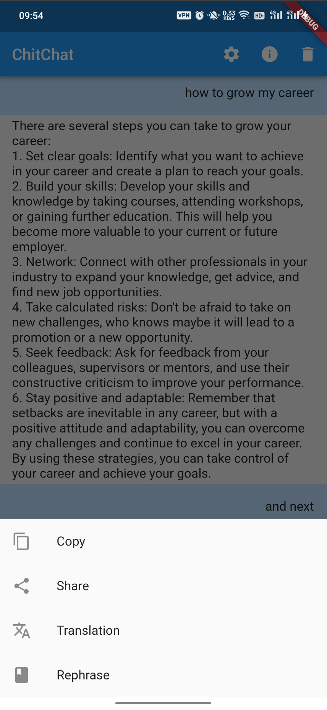
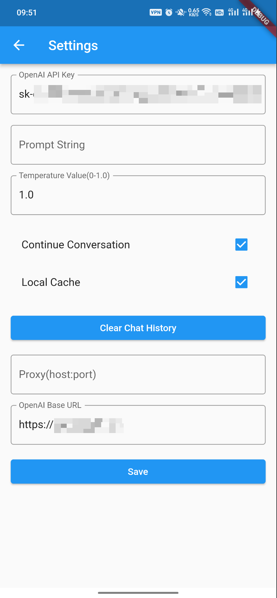
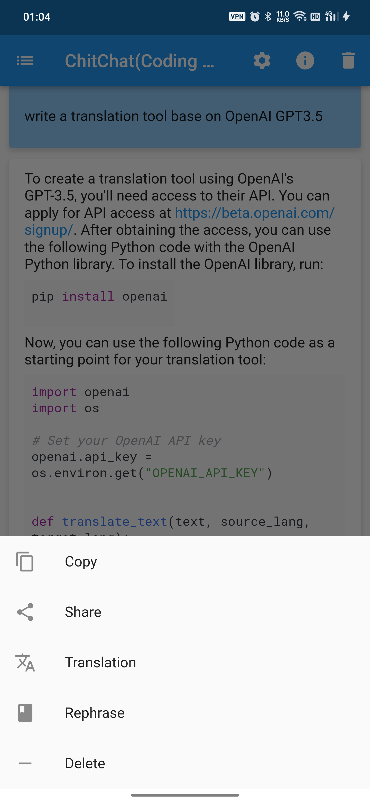

## ChitChat

ChitChat is a simple chat application that utilizes the GPT-3.5 Turbo model to provide an interactive
chat experience.

ChitChat is a cross-platform chat application that uses cutting-edge artificial intelligence to
provide engaging conversations. Chat with the GPT model, explore the chat history, and customize
your experience with our settings options. With ChitChat, you can chat like friends, learn new
things, and have fun!

It is built with Flutter and supports platforms
- Android
- iOS
- Web
- Mac OS X
- Linux
- Windows

### Downloads
For Mac/Android, You can download in from the release builds
- https://github.com/pjq/ChitChat/releases/

For Android, you can also download from Google Play
- Android https://play.google.com/store/apps/details?id=me.pjq.chitchat

### Features

- Chat with GPT-3.5 Turbo model.
- Chat history persistence.
- Clean chat history.
- Support for continuous conversation mode.
- Support for Chinese character display.
- Copy, share, and translate, rephrase chat messages.
- Retry logic in case of message send failure.
- Proxy settings
- OpenAI Base URL Support

### Getting Started

To get started with ChitChat, clone this repository to your local machine and open it in your
preferred IDE. Then, run the following command in the terminal to download the required
dependencies:

```bash
flutter pub get
```

To run the application, connect your device or emulator and run the following command:

```bash
flutter run
```

### Usage

When you launch the application, you will be taken to the chat screen where you can enter text to
send to the GPT-3.5 Turbo model. The model will then generate a response that will be displayed in
the chat window.

You can also access the settings screen by tapping on the settings icon in the app bar. Here, you
can set the OpenAI API key, prompt string, and temperature value.

To copy or share a chat message, simply long-press on the message and select the appropriate action
from the context menu.

To translate a chat message, long-press on the message and select the "Translate" option. This will
open the Google Translate app, where you can choose the language to translate to.

### Contributing

Contributions are welcome and appreciated. To contribute to ChatGPT, follow these steps:

1. Fork this repository.
2. Create a new branch for your changes.
3. Make your changes and commit them, with clear commit messages.
4. Push your changes to your fork.
5. Open a pull request.

### License

ChatGPT is licensed under the MIT license. See LICENSE for more information.

### Release command

```shell
git tag 1.0.0-mac && git push origin 1.0.0-mac
git tag 1.0.0-android && git push origin 1.0.0-android
```

Or delete tag and push again
```shell
git tag -d 1.1.1-mac &&  git push origin --delete 1.1.1-mac &&  git tag 1.1.1-mac && git push origin 1.1.1-mac
echo " git tag -d 1.1.1-mac &&  git push origin --delete 1.1.1-mac &&  git tag 1.1.1-mac && git push origin 1.1.1-mac" | sed "s/mac/android/g" | sed "s/1.1.1/1.1.2/g"
```

### Generate l10n by Call GPT 3.5 Turbo API

```shell
cd lib/l10n
python3 ../../tools/l10n.py --file app_en.arb;
```

## Getting Started for Flutter

This project is a starting point for a Flutter application.

A few resources to get you started if this is your first Flutter project:

- [Lab: Write your first Flutter app](https://docs.flutter.dev/get-started/codelab)
- [Cookbook: Useful Flutter samples](https://docs.flutter.dev/cookbook)

For help getting started with Flutter development, view the
[online documentation](https://docs.flutter.dev/), which offers tutorials,
samples, guidance on mobile development, and a full API reference.

### Screenshots




