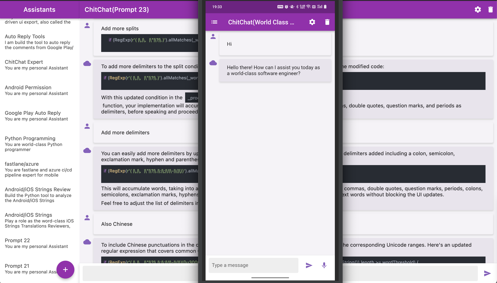
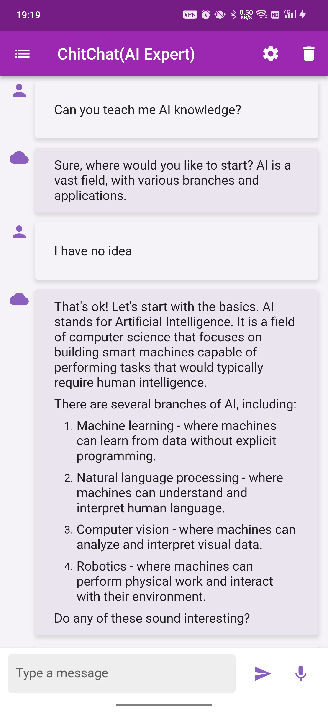
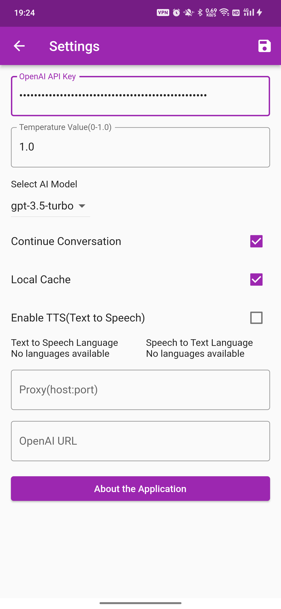
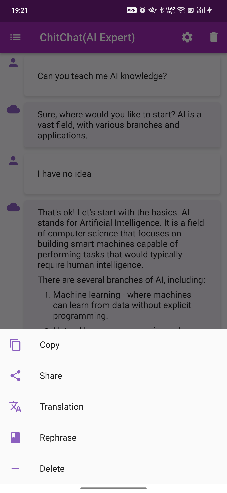

# Introducing ChitChat App 🎉
ChitChat is a powerful and easy-to-use app that allows you to connect with AI models such as GPT-3.5-turbo and GPT-4 for engaging and productive conversations. Here's what makes ChitChat your ultimate AI chat collaborator:

- 💬 **Multiple AI Models**: Choose between gpt-3.5-turbo or GPT-4 for personalized and dynamic conversations.
- 🌍 **Internationalization Support**: Supports i18n for effortless communication in multiple languages.
- 🔊 **Text-to-Speech & Speech-to-Text**: Seamlessly convert text to speech and vice versa for a hands-free experience.
- 📜 **Multi-line Input**: Easily paste or input multiple lines of text.
- 📡 **Multi-channel Chat**: Engage in conversations across different channels.
- 📚 **Prompt Management**: Add, edit, and manage multiple prompts.
- 🎯 **API Integration**: Utilizes stream=true API call for fast, efficient interactions.
- 📝 **Markdown & Rich Text**: Enjoy Markdown support for enhanced text formatting.
- 🚀 **Advanced Features**q: Chat history persistence, proxy settings, continuous conversation mode, base URL settings, and more.
- 🔄 **Translation & Rephrasing**: Built-in translation and rephrase actions for instant multilingual support.
- 📤 **Easy Sharing**: Conveniently copy or share your conversations with others.

Discover the power of engaging, AI-driven conversations with **ChitChat App**! Download now and start chatting! 🚀
- [ChitChat App](https://chitchat.pjq.me)

It is built with Flutter and supports platforms
- Android
- iOS
- Web
- Mac OS X
- Linux
- Windows

### Downloads
For Mac/Android, You can download in from the release builds
- https://github.com/pjq/ChitChat/releases/

For Android, you can also download from Google Play
- Android https://play.google.com/store/apps/details?id=me.pjq.chitchat
For iOS, you can download from the App Store
- https://apps.apple.com/cn/app/chitchat-your-best-assistant/id6447462831

### Watch the video
<a href="http://www.youtube.com/watch?feature=player_embedded&v=OeV6ms91L8U" target="_blank">
 
</a>


### Usage

When you launch the application, you will be taken to the chat screen where you can enter text to
send to the GPT-3.5 Turbo model. The model will then generate a response that will be displayed in
the chat window.

You can also access the settings screen by tapping on the settings icon in the app bar. Here, you
can set the OpenAI API key, prompt string, and temperature value.

To copy or share a chat message, simply click on the message and select the appropriate action
from the context menu.

To translate a chat message, click on the message and select the "Translate" option. This will
open the Google Translate app, where you can choose the language to translate to.

### Contributing

Contributions are welcome and appreciated. To contribute to ChatGPT, follow these steps:

1. Fork this repository.
2. Create a new branch for your changes.
3. Make your changes and commit them, with clear commit messages.
4. Push your changes to your fork.
5. Open a pull request.

### License

It is licensed under the MIT license. See LICENSE for more information.

### Release command

```shell
git tag 1.0.0-mac && git push origin 1.0.0-mac
git tag 1.0.0-android && git push origin 1.0.0-android
```

Or delete tag and push again
```shell
git tag -d 1.1.1-mac &&  git push origin --delete 1.1.1-mac &&  git tag 1.1.1-mac && git push origin 1.1.1-mac
echo " git tag -d 1.1.1-mac &&  git push origin --delete 1.1.1-mac &&  git tag 1.1.1-mac && git push origin 1.1.1-mac" | sed "s/mac/android/g" | sed "s/1.1.1/1.1.2/g"
```

Or with one command line
```shell
CURRENT_VERSION=1.2.0 && PLATFORM=mac &&  git tag $CURRENT_VERSION-$PLATFORM && git push origin $CURRENT_VERSION-$PLATFORM && PLATFORM=android && git tag $CURRENT_VERSION-$PLATFORM && git push origin $CURRENT_VERSION-$PLATFORM
```
If already exists, then run can run it again. 
```shell
CURRENT_VERSION=1.1.28 && PLATFORM=mac && git tag -d $CURRENT_VERSION-$PLATFORM && git push origin :refs/tags/$CURRENT_VERSION-$PLATFORM && git tag $CURRENT_VERSION-$PLATFORM && git push origin $CURRENT_VERSION-$PLATFORM && PLATFORM=android && git tag -d $CURRENT_VERSION-$PLATFORM && git push origin :refs/tags/$CURRENT_VERSION-$PLATFORM && git tag $CURRENT_VERSION-$PLATFORM && git push origin $CURRENT_VERSION-$PLATFORM
```

#### Build dmg for Mac
```shell
flutter build macos --release
hdiutil create -format UDZO -srcfolder build/macos/Build/Products/Release/chitchat.app build/macos/Build/Products/Release/chitchat.dmg
```
Then you can get the dmg file in `build/macos/Build/Products/Release/chitchat.dmg`

#### Build apk for Android
```shell
flutter build apk  --release
flutter build appbundle  --release
```
Then you can find the apk/aab file in `build/app/outputs/flutter-apk/*.apk,build/app/outputs/bundle/release/*.aab`

#### Build for web
```shell
flutter build web 
```
And the web files will be in 
```shell
build/web
```

And update the base href in build/web/index.html to "./"
```html
<base href="./">
```

#### Deploy the website
```shell
cp -a build/web website/
scp -r website/* ${host}:/mnt/backup_ssf/chitchat/
```

#### Build & Deploy Script

```shell
./deploy.sh user host
```

### Generate l10n by Call GPT 3.5 Turbo API

```shell
flutter gen-l10n  -v 
```

```shell
cd lib/l10n
python3 ../../tools/l10n.py --file app_en.arb;
```

If need to `regenerate` the full translation, please add `--full_translation`, otherwise it will only generate the new strings.
```shell
cd lib/l10n
python3 ../../tools/l10n.py --file app_en.arb --full_translation;
```

### Screenshots






### Getting Started

To get started with ChitChat, clone this repository to your local machine and open it in your
preferred IDE. Then, run the following command in the terminal to download the required
dependencies:

```bash
flutter pub get
```

To run the application, connect your device or emulator and run the following command:

```bash
flutter run
```

To run on iPhone, need add `--release`
```shell
 flutter run --release
```

## Getting Started for Flutter
This project is a starting point for a Flutter application.

A few resources to get you started if this is your first Flutter project:

- [Lab: Write your first Flutter app](https://docs.flutter.dev/get-started/codelab)
- [Cookbook: Useful Flutter samples](https://docs.flutter.dev/cookbook)

For help getting started with Flutter development, view the
[online documentation](https://docs.flutter.dev/), which offers tutorials,
samples, guidance on mobile development, and a full API reference.
