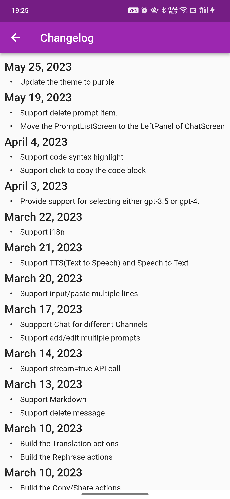

## ChatGPT
ChatGPT is a simple chat application that utilizes the GPT-3.5 Turbo model to provide an interactive chat experience. It is built with Flutter and supports both Android and iOS platforms.

### Features
- Chat with GPT-3.5 Turbo model.
- Chat history persistence.
- Support for continuous conversation mode.
- Support for Chinese character display.
- Copy, share, and translate chat messages.
- Retry logic in case of message send failure.

### Getting Started
To get started with ChatGPT, clone this repository to your local machine and open it in your preferred IDE. Then, run the following command in the terminal to download the required dependencies:

```bash
flutter pub get
```
To run the application, connect your device or emulator and run the following command:

```bash
flutter run
```
### Usage
When you launch the application, you will be taken to the chat screen where you can enter text to send to the GPT-3.5 Turbo model. The model will then generate a response that will be displayed in the chat window.

You can also access the settings screen by tapping on the settings icon in the app bar. Here, you can set the OpenAI API key, prompt string, and temperature value.

To copy or share a chat message, simply long-press on the message and select the appropriate action from the context menu.

To translate a chat message, long-press on the message and select the "Translate" option. This will open the Google Translate app, where you can choose the language to translate to.

### Contributing
Contributions are welcome and appreciated. To contribute to ChatGPT, follow these steps:

1. Fork this repository.
2. Create a new branch for your changes.
3. Make your changes and commit them, with clear commit messages.
4. Push your changes to your fork.
5. Open a pull request.
### License
ChatGPT is licensed under the MIT license. See LICENSE for more information.

## Getting Started for Flutter

This project is a starting point for a Flutter application.

A few resources to get you started if this is your first Flutter project:

- [Lab: Write your first Flutter app](https://docs.flutter.dev/get-started/codelab)
- [Cookbook: Useful Flutter samples](https://docs.flutter.dev/cookbook)

For help getting started with Flutter development, view the
[online documentation](https://docs.flutter.dev/), which offers tutorials,
samples, guidance on mobile development, and a full API reference.

### Screenshots




